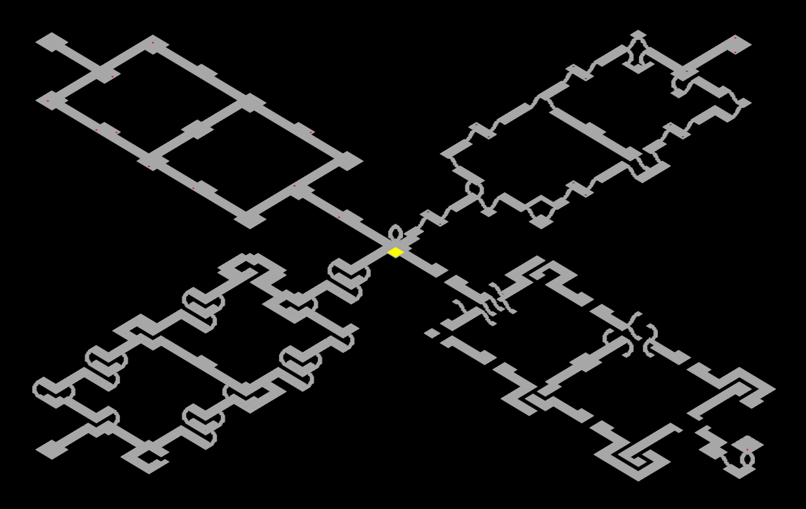

# d2-mapper

Diablo 2 maps are randomly generated based on a seed value and difficulty.  
There is another project which uses Diablo 2 to generate JSON payloads describing the layout of these maps.
This repo takes that data and creates HTML pages showing maps visually.

Refer to this project for more info <https://github.com/blacha/diablo2/tree/master/packages/map>

This repo uses the above project as a backend server to generate data based on a given seed/difficulty.
If you don't have that project setup to fetch JSON data, this repo comes with a few sample payloads you can try.

At the moment this project is setup to take one sample output `src/dist/26396577_Hell.json` and generate SVGs from it.

## Examples

##### Durance of hate level 2


##### Arcane Sanctuary



## Setup backend

This repo does not include the backend server.
Please refer to <https://github.com/blacha/diablo2/tree/master/packages/map>

However to get the above project working:

* Install Diablo 2 LOD 1.14b
* Install Project Diablo 2
* Install docker

```bash
docker pull blacha/diablo2
docker run -it -v "/E/Games/Diablo II":/app/game docker.io/blacha/diablo2:latest /bin/bash
wine regedit /app/d2.install.reg
wine bin/d2-map.exe game --seed 10 --level 1 --difficulty 0
```

The last wine command tests that it's working

This command will run a REST API server on port 8899:

```bash
docker run -v "/E/Games/Diablo II":/app/game -p 8899:8899 docker.io/blacha/diablo2:latest
```

### Install

```bash
npm install
npm build
```

### Execute example

```bash
npm run example
```

This will generate HTML for every level in `./dist/svg/<seed>/<difficulty>` folder.
You can open these HTML pages in any browser.

In `example.ts` you can set a different seed value.

This repo has an already cached response for 26396577/Hell and 1294978398/Hell so you can run this without a backed for those 2 settings.

### Usage

This is a package that can be used to generate images from raw JSON.

```typescript
import { generate } from '@mgalos999/d2-mapper';

generate("seedValue", "difficulty", './public/', "http://localhost:8899");
```

```typescript
import { generateHTML } from '@mgalos999/d2-mapper';

const mapData = { <individual map data> };
const templateHTML = fs.readFileSync("./src/generate/template/template.html", { encoding: "utf8" });
generateHTML(mapData, './public/', templateHTML);
```

### Notes

* Purple box for exits
* Red dot for monsters
* Yellow box for waypoint.

## TODO

* Viewbox alignment needs to be improved, seems to be a tricky thing to solve
* Special icons/markings for exits and special items to be improved