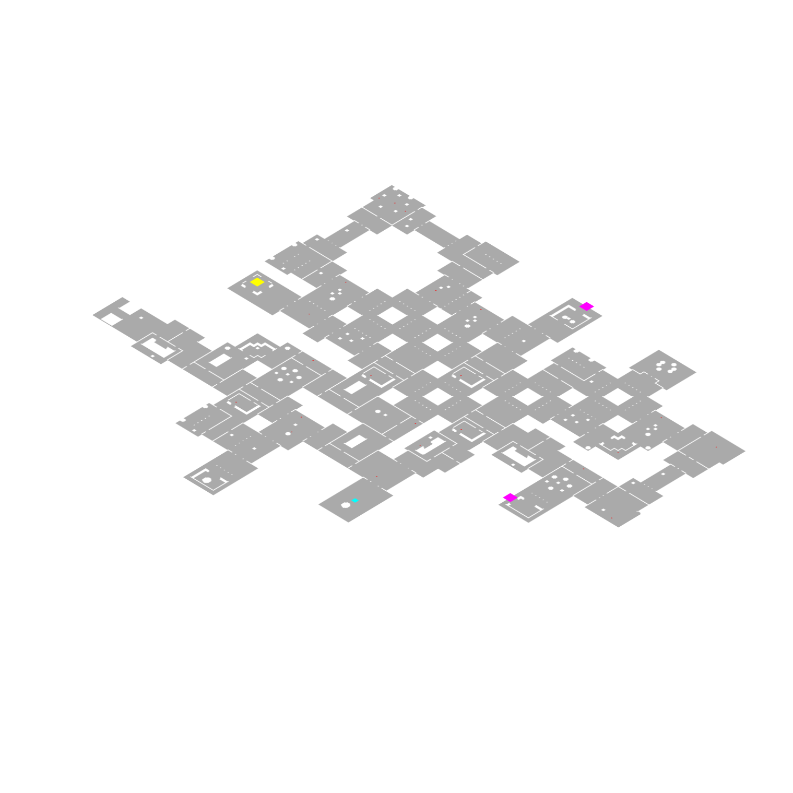

# d2-mapper 

This repo takes data generated by this project https://github.com/blacha/diablo2/tree/master/packages/map and creates SVGs.

At the moment this project simply takes one sample output `src/data/hell.json` and generates SVGs from it.
However if you get that above package working you can generate JSON payloads of any given map seed.




### Install

```bash
npm install
npm build
```

### Execute
```bash
npm run generate
```
This will generate SVGs for every level in `build/maps` folder.

### Notes
- Doors are marked with a purple box.
- Special mobs are marked with a red dot
- Waypoint icon for waypoint


## TODO:
- Hook this up to an API to generate from live data
- Special icons/markings for exits and special items needs to be improved
- More reliable creation of SVG, seems rotating seems to create issues with centering the image in the viewbox
